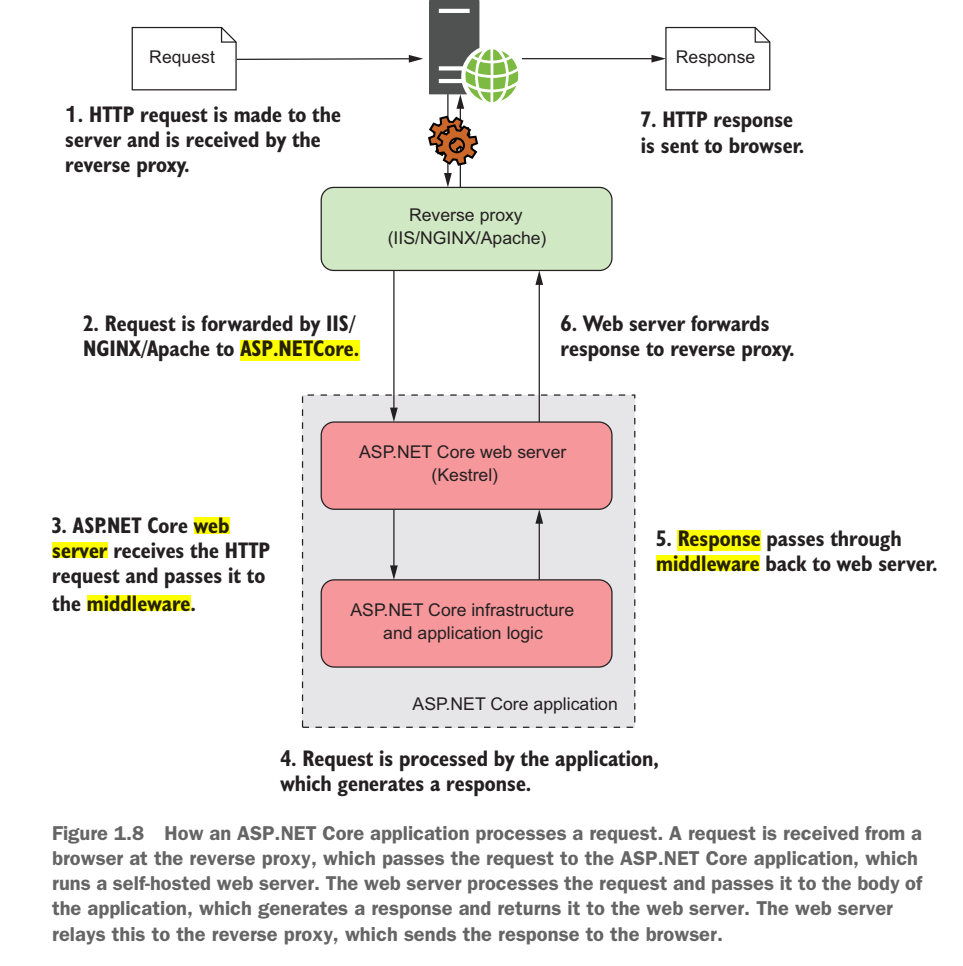
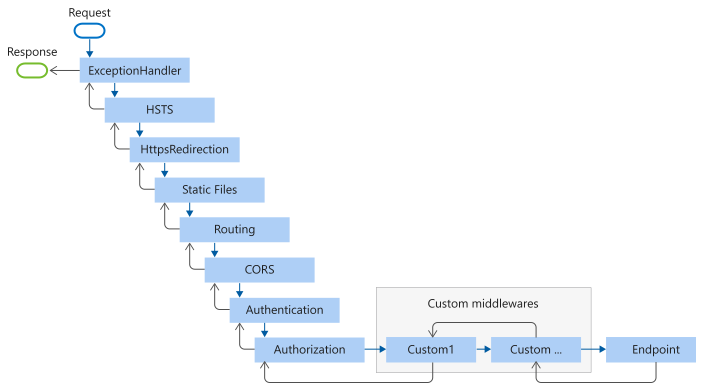

# Anatomia de uma Aplicação .NET

No ecossistema do .NET, que abrange tanto o .NET Framework quanto o .NET Core (agora unificado como .NET), existem vários tipos de aplicações que podem ser desenvolvidas, cada uma com sua própria estrutura e finalidade. O .NET é uma plataforma de desenvolvimento de software desenvolvida pela Microsoft, que inclui um vasto conjunto de ferramentas, bibliotecas e frameworks para a criação de aplicações desktop, web, mobile, serviços e muito mais.

O .NET SDK (Software Development Kit) é o conjunto de ferramentas que permite criar, compilar, depurar e publicar aplicações .NET. Ele inclui o compilador C# (ou VB.NET), as bibliotecas de classes .NET (como ASP.NET Core, Entity Framework Core, etc.) e outras utilidades como o MSBuild, responsável por compilar e construir projetos .NET.

O ambiente de execução .NET (também conhecido como Common Language Runtime ou CLR) é a máquina virtual que gerencia a execução de programas .NET. Ele oferece serviços como gerenciamento de memória, coleta de lixo, controle de exceções e execução de código gerenciado, garantindo a interoperabilidade entre diferentes linguagens suportadas pelo .NET.

Durante o processo de build do .NET, o código fonte é compilado para a Linguagem Intermediária (IL), também conhecida como Common Intermediate Language (CIL). Essa IL é então convertida em código nativo pela CLR durante a execução da aplicação. Os binários resultantes incluem o código do projeto em arquivos de Linguagem Intermediária (IL) com extensão .dll.

Em resumo, o ecossistema .NET oferece uma ampla gama de ferramentas e tecnologias para o desenvolvimento de aplicações, sendo o SDK, o CLR e o processo de geração de IL (Linguagem Intermediária) componentes fundamentais no processo de criação, execução e construção de projetos .NET.

## Tipos de Aplicações .NET mais comuns

1. **WebAPI:** Uma aplicação voltada para fornecer serviços e endpoints RESTful para interação com clientes, como navegadores web, aplicativos móveis e outros sistemas. Ela utiliza o protocolo HTTP para comunicação.

2. **Web Application com SSR (Server-Side Rendering):** Aplicações web que renderizam parte do conteúdo no servidor antes de enviá-lo para o cliente. É comumente usado em aplicações que precisam de SEO e em casos onde a renderização no servidor é mais eficiente.

3. **Console Application:** Aplicações de console que são executadas em um prompt de comando, úteis para tarefas automatizadas, scripts e interações diretas com o usuário através da linha de comando.

4. **MAUI (Multi-platform App UI):** Uma evolução do Xamarin.Forms, permite o desenvolvimento de aplicativos multiplataforma para iOS, Android e Windows usando um único código-fonte.

6. **Libraries (.NET Standard/Core Libraries):** As bibliotecas (.NET Standard/Core Libraries) são conjuntos de código reutilizável que fornecem funcionalidades específicas para o desenvolvimento de aplicações .NET.

### WebAPI

Uma WebAPI é um tipo de aplicação que segue o estilo arquitetural REST (Representational State Transfer), baseado no protocolo HTTP. Ela é projetada para ser uma interface entre sistemas e permite que diferentes aplicações se comuniquem de forma eficiente e escalável.

- **Protocolo HTTP:** É um protocolo de comunicação utilizado para transferência de dados na World Wide Web. Ele define métodos como GET, POST, PUT, DELETE, entre outros, para manipulação de recursos em um servidor.

- **REST API (API Restful):** É uma API que segue os princípios do estilo arquitetural REST. Isso inclui o uso de URIs (Uniform Resource Identifiers) para identificar recursos, métodos HTTP para operações CRUD (Create, Read, Update, Delete) e um conjunto de status de resposta padronizado.

- **[Teorema de Richardson](https://martinfowler.com/articles/richardsonMaturityModel.html):** Proposto por Leonard Richardson, esse teorema estabelece níveis de maturidade em APIs REST, divididos em níveis de Richardson, que vão do nível 0 (sem uso adequado de REST) ao nível 3 (uso completo dos princípios RESTful).

O foco principal do curso está na WebAPI, devido à sua relevância na criação de serviços modernos e na integração de sistemas distribuídos de forma eficiente e escalável.

Essa é uma visão geral da anatomia de uma aplicação .NET, abordando os tipos comuns de aplicações e dando ênfase especial na WebAPI, protocolo HTTP, REST API e o Teorema de Richardson como referência para o desenvolvimento de APIs RESTful.

## Demo

Para criar uma `webapi`, com o [dotnet sdk](https://dotnet.microsoft.com/download) instalado, rode o comando:

```sh
dotnet new webapi -n MinhaApi
```

## Ciclo de vida de uma requisição HTTP em aplicações ASP.NET Core

### Servers

Uma aplicação [ASP.NET Core](https://learn.microsoft.com/aspnet/core/introduction-to-aspnet-core?view=aspnetcore-8.0) é executada com uma implementação de servidor `HTTP in-process`. A implementação do servidor escuta por requisições HTTP e as disponibiliza para a aplicação como um conjunto de funcionalidades de requisição, compostas em um [HttpContext](https://learn.microsoft.com/dotnet/api/system.web.httpcontext?view=netframework-4.8.1).

Com `ASP.NET Core`, você pode escolher entre `in-process` servidores: [Kestrel](https://learn.microsoft.com/aspnet/core/fundamentals/servers/kestrel?view=aspnetcore-8.0), [HTTP.sys](https://learn.microsoft.com/aspnet/core/fundamentals/servers/httpsys?view=aspnetcore-8.0).
O mais comum nas aplicações modernas, é a utilização do `Kestrel`

### Kestrel

O `Kestrel` é um servidor web de código aberto e multiplataforma desenvolvido pela Microsoft. Ele é o servidor web padrão usado pelo `ASP.NET Core` para processar solicitações HTTP em aplicativos web. O `Kestrel` é leve, rápido e altamente escalável, sendo capaz de lidar com um grande volume de solicitações de forma eficiente. Ele é frequentemente combinado com servidores `proxy reversos`, como o `IIS` ou o `Nginx`, para gerenciar o tráfego da web de maneira mais robusta e flexível.

O `Kestrel` e a aplicação `ASP.NET Core` têm responsabilidades distintas no processamento de solicitações HTTP:

**Kestrel:**

- Gerenciamento do servidor HTTP: O Kestrel é responsável por iniciar, gerenciar e manter o servidor web HTTP que lida com as solicitações HTTP recebidas pelos clientes.
- Escuta de Portas: O Kestrel escuta em uma porta específica para receber solicitações HTTP vindas dos clientes.
- Gerenciamento de Conexões: Ele gerencia as conexões de rede entre os clientes e o servidor, garantindo a estabilidade e eficiência na comunicação.
- Encaminhamento de Solicitações: O Kestrel encaminha as solicitações recebidas para a aplicação ASP.NET Core para processamento.

**Aplicação ASP.NET Core:**

- Roteamento: A aplicação define as rotas e regras de roteamento para direcionar solicitações HTTP para os controladores e endpoints apropriados.
- Lógica de Negócio: Responsável por executar a lógica de negócio da aplicação, incluindo acesso a dados, autenticação, autorização, manipulação de requisições, entre outras tarefas.
- Geração de Respostas: Com base no processamento da solicitação, a aplicação gera e retorna as respostas HTTP adequadas, incluindo status, cabeçalhos e conteúdo.
- Middleware: Implementação de middlewares para processar solicitações HTTP antes de chegarem aos controladores, como autenticação, compressão de resposta, cache, entre outros.


### Reverse-Proxy

Um servidor `proxy reverso` captura a requisição antes de passá-la para sua aplicação. No Windows, o servidor `proxy reverso` será tipicamente o `IIS`, e no `Linux` ou macOS pode ser o `NGINX` ou `Apache`. Um servidor `proxy reverso` é um software responsável por receber requisições e encaminhá-las para o servidor web apropriado. O servidor `proxy reverso` é exposto diretamente à internet, enquanto o servidor web subjacente é exposto apenas ao proxy. Essa configuração tem vários benefícios, principalmente em termos de segurança e desempenho para os servidores web. A requisição é encaminhada do servidor `proxy reverso` para sua aplicação ASP.NET Core.

Cada aplicação ASP.NET Core possui um servidor web integrado, o `Kestrel` por padrão, que é responsável por receber requisições brutas e construir uma representação interna dos dados, o objeto `HttpContext`, que pode ser usado pelo restante da aplicação.



### ASP.NET Core request pipeline

Existe uma grande complexidade para a requisição chegar até o processo `ASP.NET Core`, entretanto, a complexidade não para por aí, quando a requisição chega até o processo, muitas outras coisas acontecem.

O pipeline de requisições do ASP.NET Core consiste em uma sequência de `delegates` de requisição, chamados um após o outro. O diagrama a seguir demonstra o conceito. A execução segue as setas pretas.


### Middlewares

O diagrama a seguir mostra o pipeline completo de processamento de requisições para aplicativos `ASP.NET Core MVC` e `Razor Pages`. Você pode ver como, em um aplicativo típico, os `middlewares` existentes são ordenados e onde os `middlewares` personalizados são adicionados. Você tem total controle sobre como reorganizar os `middlewares` existentes ou injetar novos `middlewares` personalizados conforme necessário para seus cenários.


