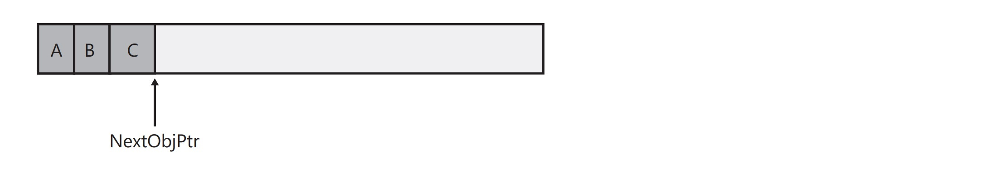

# Recursos do Common Language Runtime

O Common Language Runtime (CLR) é, como o nome indica, uma plataforma de execução que pode ser usada por diferentes e variadas linguagens de programação. Ele fornece recursos essenciais, como gerenciamento de memória, carregamento de assemblies, segurança, tratamento de exceções e sincronização de threads, para todas as linguagens que o utilizam. Por exemplo, o CLR usa exceções para relatar erros, então todas as linguagens que o utilizam também usam exceções para relatar erros. Além disso, o CLR permite a criação de threads, o que significa que qualquer linguagem que o utilize também pode criar threads.

Durante a execução, o CLR não tem conhecimento sobre qual linguagem de programação o desenvolvedor utilizou para escrever o código-fonte. Isso significa que você pode escolher a linguagem que melhor expressa suas intenções. Você pode desenvolver seu código em qualquer linguagem de programação, desde que o compilador utilizado seja direcionado para o CLR.

Então, qual é a vantagem de usar uma linguagem de programação em detrimento de outra? Bem, os compiladores funcionam como verificadores de sintaxe e analisadores de "código correto". Eles examinam seu código-fonte, garantem que o que você escreveu faz sentido e geram código que descreve suas intenções. Diferentes linguagens de programação oferecem diferentes sintaxes, e essa escolha pode ser valiosa. Por exemplo, para aplicações matemáticas ou financeiras, expressar suas intenções usando a sintaxe APL pode economizar muito tempo de desenvolvimento em comparação com a sintaxe Perl, por exemplo.

A Microsoft desenvolveu vários compiladores de linguagens que visam o CLR: C++/CLI, C# (pronunciado "C sharp"), Visual Basic, F# (pronunciado "F sharp"), Iron Python, Iron Ruby e um Assembler de Linguagem Intermediária (IL). Além da Microsoft, várias outras empresas, faculdades e universidades também criaram compiladores que geram código para o CLR. Existem compiladores para uma ampla variedade de linguagens, como Ada, APL, Caml, COBOL, Eiffel, Forth, Fortran, Haskell, Lexico, LISP, LOGO, Lua, Mercury, ML, Mondrian, Oberon, Pascal, Perl, PHP, Prolog, RPG, Scheme, Smalltalk e Tcl/Tk.

## ThreadPool

Criar e destruir uma thread é uma operação cara em termos de tempo. Além disso, ter muitas threads desperdiça recursos de memória e prejudica o desempenho devido ao sistema operacional ter que agendar e alternar de contexto entre as threads em execução. Para melhorar essa situação, o CLR contém código para gerenciar seu próprio ThreadPool. Você pode pensar em um [ThreadPool](https://learn.microsoft.com/dotnet/api/system.threading.threadpool?view=net-8.0) como um conjunto de threads disponíveis para uso em seu aplicativo.

Quando o CLR é inicializado, o [ThreadPool](https://learn.microsoft.com/dotnet/api/system.threading.threadpool?view=net-8.0) não possui threads nele. Internamente, o [ThreadPool](https://learn.microsoft.com/dotnet/api/system.threading.threadpool?view=net-8.0) mantém uma fila de solicitações de operações. Quando seu aplicativo deseja realizar uma operação assíncrona, você chama algum método que adiciona uma entrada na fila do [ThreadPool](https://learn.microsoft.com/dotnet/api/system.threading.threadpool?view=net-8.0). O código do [ThreadPool](https://learn.microsoft.com/dotnet/api/system.threading.threadpool?view=net-8.0) extrairá entradas desta fila e despachará a entrada para uma thread do [ThreadPool](https://learn.microsoft.com/dotnet/api/system.threading.threadpool?view=net-8.0). Se não houver threads no [ThreadPool](https://learn.microsoft.com/dotnet/api/system.threading.threadpool?view=net-8.0), uma nova thread será criada. Criar uma thread tem um custo de desempenho associado a isso (como já discutido). No entanto, quando uma thread do [ThreadPool](https://learn.microsoft.com/dotnet/api/system.threading.threadpool?view=net-8.0) conclui sua tarefa, a thread não é destruída; em vez disso, ela é devolvida ao [ThreadPool](https://learn.microsoft.com/dotnet/api/system.threading.threadpool?view=net-8.0), onde fica ociosa esperando para responder a outra solicitação. Como a thread não se destrói, não há custo de desempenho adicional.

Se seu aplicativo faz muitas solicitações ao [ThreadPool](https://learn.microsoft.com/dotnet/api/system.threading.threadpool?view=net-8.0), ele tentará atender a todas as solicitações usando apenas esta única thread. No entanto, se seu aplicativo estiver enfileirando várias solicitações mais rápido do que o [ThreadPool](https://learn.microsoft.com/dotnet/api/system.threading.threadpool?view=net-8.0) pode lidar com elas, threads adicionais serão criadas. Seu aplicativo eventualmente chegará a um ponto em que todas as suas solicitações podem ser tratadas por um pequeno número de threads, então o [ThreadPool](https://learn.microsoft.com/dotnet/api/system.threading.threadpool?view=net-8.0) não deve precisar criar muitas threads.

### Usando o ThreadPool

A maneira mais fácil de usar o pool de threads é usar a [Task Parallel Library (TPL)](https://learn.microsoft.com/dotnet/standard/parallel-programming/task-based-asynchronous-programming). Por padrão, tipos da TPL como `Task` e `Task<TResult>` utilizam threads do `ThreadPool` para executar tarefas.

Você também pode usar o `ThreadPool` chamando ThreadPool.QueueUserWorkItem a partir de código gerenciado (ou ICorThreadpool::CorQueueUserWorkItem a partir de código não gerenciado) e passando um delegado System.Threading.WaitCallback que representa o método que executa a tarefa.

Outra forma de usar o `ThreadPool` é enfileirar itens de trabalho relacionados a uma operação de espera usando o método `ThreadPool.RegisterWaitForSingleObject` e passando um `System.Threading.WaitHandle` que, quando sinalizado ou quando expira o tempo limite, chama o método representado pelo delegado `System.Threading.WaitOrTimerCallback`. Threads do `ThreadPool` são usadas para invocar os métodos de retorno de chamada.

#### Demonstração ThreadPool

[demo_thread_pool](../demos/demo_thread_pool/)

### Papel do ThreadPool no ASP.NET Core request pipeline

O `ThreadPool` desempenha um papel fundamental no pipeline de requisições do ASP.NET Core, gerenciando um conjunto de threads reutilizáveis para processar solicitações de forma eficiente.

Quando uma requisição HTTP é recebida pelo servidor ASP.NET Core, ela é colocada na fila do `ThreadPool`. Este, por sua vez, atribui essas solicitações às threads disponíveis para execução.

À medida que as threads do `ThreadPool` se tornam disponíveis, elas são designadas para processar as solicitações na fila, permitindo que várias requisições sejam processadas simultaneamente de forma concorrente, sem a necessidade de criar e destruir threads a cada requisição.

Essa capacidade de atribuir e reutilizar threads do `ThreadPool` para processar várias requisições simultaneamente é crucial para garantir um bom desempenho e escalabilidade em aplicações ASP.NET Core, especialmente em ambientes com alto volume de tráfego e múltiplas solicitações concorrentes.

#### Demonstração ThreadPool no ASP.NET Core request pipeline

[demo threadpool .net](../demos/demo_thread_pool_no_aspnet/Threadpool_Aspnet/)

## Managed Heap

Todo programa utiliza recursos de um tipo ou outro, como arquivos, buffers de memória, espaço na tela, conexões de rede, recursos de banco de dados, e assim por diante. Em um ambiente orientado a objetos, cada tipo identifica algum recurso disponível para o programa. Para utilizar um recurso, é necessário alocar memória para representar o tipo. Os seguintes passos são necessários para acessar um recurso:

1. Alocar memória para o tipo que representa o recurso (geralmente feito usando o operador `new` do C#).
2. Inicializar a memória para definir o estado inicial do recurso e torná-lo utilizável. O construtor de instância do tipo é responsável por definir esse estado inicial.
3. Utilizar o recurso acessando os membros do tipo (repetindo conforme necessário).
4. Desfazer o estado do recurso para limpeza.
5. Liberar a memória. O coletor de lixo é exclusivamente responsável por esta etapa.

O CLR também mantém um ponteiro, chamado NextObjPtr, que indica onde o próximo objeto será alocado dentro do heap. Inicialmente, NextObjPtr é definido para o endereço base da região do espaço de endereçamento. À medida que a região é preenchida com objetos não-garbage, o CLR aloca mais regiões até que o espaço de endereço virtual do processo esteja completo. Portanto, a memória da aplicação é limitada pelo espaço de endereço virtual do processo. Em um processo de 32 bits, você pode alocar cerca de 1,5 gigabytes (GB) e em um processo de 64 bits, você pode alocar cerca de 8 terabytes.

O operador `new` do C# faz com que o CLR execute os seguintes passos:

1. Calcular o número de bytes necessários para os campos do tipo (e todos os campos que ele herda de seus tipos base).
2. Adicionar os bytes necessários para o overhead de um objeto. Cada objeto possui dois campos de overhead: um ponteiro de objeto de tipo e um índice de bloco de sincronização. Para um aplicativo de 32 bits, cada um desses campos requer 32 bits, adicionando 8 bytes a cada objeto. Para um aplicativo de 64 bits, cada campo tem 64 bits, adicionando 16 bytes a cada objeto.
3. Verificar se os bytes necessários para alocar o objeto estão disponíveis na região. Se houver espaço livre suficiente no heap gerenciado, o objeto se encaixará, começando no endereço apontado por NextObjPtr, e esses bytes serão zerados. O construtor do tipo é chamado (passando NextObjPtr para o parâmetro `this`), e o operador `new` retorna uma referência para o objeto. Pouco antes da referência ser retornada, NextObjPtr avança além do objeto e agora aponta para o endereço onde o próximo objeto será colocado no heap.

Até agora, parece que o heap gerenciado oferece excelentes características de desempenho. No entanto, o que acabei de descrever assume que a memória é infinita e que o CLR pode sempre alocar novos objetos no final. No entanto, a memória não é infinita, e o CLR emprega uma técnica conhecida como coleta de lixo (GC) para "excluir" objetos no heap que sua aplicação não precisa mais acessar.

## Garbage Collection

Quando um aplicativo usa o operador `new` para criar um objeto, pode acontecer de não haver espaço suficiente na região de memória para alocar o objeto. Nesse caso, o CLR (Common Language Runtime) realiza uma coleta de lixo (GC).

O algoritmo de rastreamento de referência se concentra em variáveis de tipo de referência, que são aquelas capazes de referenciar objetos no heap. Já as variáveis de tipo de valor contêm diretamente a instância do tipo de valor. As variáveis de tipo de referência, chamadas de roots, podem ser utilizadas em diversos contextos, como campos estáticos e de instância em uma classe, argumentos de método ou variáveis locais.

Quando o CLR inicia uma coleta de lixo, ele suspende todos os threads no processo para evitar que eles acessem objetos e alterem seu estado enquanto são examinados. Em seguida, ele executa a fase de marcação da GC, na qual define um bit em cada objeto para indicar se ele deve ser excluído ou não. Durante essa fase, o CLR verifica todas as roots ativas para determinar quais objetos elas referenciam, seguindo um processo de rastreamento de referência.

Após marcar os objetos que devem ser mantidos, o CLR inicia a fase de compactação da GC. Nessa fase, ele rearranja a memória ocupada pelos objetos marcados no heap, colocando os objetos sobreviventes de forma contígua. Isso traz benefícios como a restauração da localidade de referência, reduzindo o tamanho do conjunto de trabalho da aplicação e melhorando o desempenho ao acessar esses objetos no futuro.

No entanto, ao compactar a memória, surge um problema: as roots que apontavam para objetos sobreviventes agora apontam para onde esses objetos estavam originalmente na memória, não para suas novas localizações. Para resolver isso, o CLR ajusta as roots, garantindo que elas continuem referenciando os objetos corretamente.

Após a compactação, o ponteiro `NextObjPtr` do heap é ajustado para apontar para a próxima localização após o último objeto sobrevivente.

### Gerações

O algoritmo de coleta de lixo (GC) é baseado em várias considerações:

- É mais rápido compactar a memória de uma parte do heap gerenciado do que do heap inteiro.
- Objetos mais novos têm períodos de vida mais curtos, e objetos mais antigos têm períodos de vida mais longos.
- Objetos mais novos tendem a estar relacionados entre si e acessados pela aplicação em momentos próximos.

Para otimizar o desempenho do GC, o heap gerenciado é dividido em três gerações: 0, 1 e 2, permitindo que ele lide separadamente com objetos de vida curta e longa. O GC armazena novos objetos na geração 0. Objetos criados no início da vida da aplicação que sobrevivem às coletas são promovidos e armazenados nas gerações 1 e 2. Essa abordagem permite ao GC liberar a memória em uma geração específica em vez de liberar a memória para todo o heap gerenciado a cada coleta.

#### Geração 0

A mais jovem, contendo objetos de vida curta, como variáveis temporárias. A coleta de lixo ocorre com maior frequência aqui.

#### Geração 1

Serve como um buffer entre objetos de vida curta e longa. Após uma coleta de geração 0, a memória é compactada e objetos alcançáveis são promovidos para esta geração.

#### Geração 2

Contém objetos de vida longa, como dados estáticos em aplicativos de servidor. Objetos que sobrevivem aqui permanecem até serem coletados em futuras coletas.

Coletas de lixo ocorrem em gerações específicas conforme necessário. Sobreviventes são promovidos para a próxima geração até serem determinados como inalcançáveis em futuras coletas. O GC ajusta dinamicamente os limiares de alocação para otimizar a eficiência das coletas, equilibrando o tamanho do conjunto de trabalho da aplicação com a frequência das coletas de lixo.

Clareza e facilidade de entendimento são prioridades. Aqui estão algumas considerações sobre threading e desempenho para a coleta de lixo:

### Tipos de gc no CLR

O CLR fornece os seguintes tipos de coleta de lixo (GC):

#### Coleta de Lixo de Estação de Trabalho

A coleta de lixo de estação de trabalho é projetada para aplicativos cliente. É o tipo de coleta de lixo padrão para aplicativos autônomos. Para aplicativos hospedados, como os hospedados pelo ASP.NET, o host determina o tipo padrão de coleta de lixo.

A coleta de lixo de estação de trabalho pode ser concorrente ou não concorrente. A coleta de lixo concorrente (ou em segundo plano) permite que as threads gerenciadas continuem as operações durante uma coleta de lixo. A coleta de lixo em segundo plano substitui a coleta de lixo concorrente no .NET Framework 4 e em versões posteriores.

#### Coleta de Lixo de Servidor

A coleta de lixo de servidor é destinada a aplicativos de servidor que necessitam de alto throughput e escalabilidade.

No .NET Core, a coleta de lixo de servidor pode ser não concorrente ou em segundo plano.

No .NET Framework 4.5 e em versões posteriores, a coleta de lixo de servidor pode ser não concorrente ou em segundo plano. No .NET Framework 4 e versões anteriores, a coleta de lixo de servidor é não concorrente.

### Modo de Servidor vs. Modo de Estação de Trabalho: Compreendendo as Diferenças

O modo de servidor e o modo de estação de trabalho são dois ambientes distintos que afetam a maneira como a coleta de lixo (GC) é realizada no .NET Framework. Aqui está uma descrição das diferenças entre os dois modos:

Modo de Servidor:

- A coleta de lixo no modo de servidor ocorre em várias threads dedicadas.
- Essas threads de coleta de lixo rodam em um nível de prioridade mais alto (THREAD_PRIORITY_HIGHEST no Windows).
- Cada CPU lógica tem seu próprio heap e thread dedicada para a coleta de lixo.
- Todos os heaps são coletados simultaneamente.
- A coleta de lixo de servidor é mais rápida porque as threads dedicadas trabalham juntas de forma eficiente.
- Geralmente, há segmentos de tamanho maior na coleta de lixo de servidor, embora isso possa variar dependendo da implementação.

Modo de Estação de Trabalho:

- A coleta de lixo no modo de estação de trabalho ocorre na thread do usuário que acionou a coleta.
- A coleta de lixo permanece na mesma prioridade que a thread do usuário.
- Em computadores com apenas uma CPU lógica, o modo de estação de trabalho é sempre usado, independentemente da configuração definida.
- Pode haver competição por recursos de CPU, pois as threads de coleta de lixo (que rodam em prioridade normal) competem com outras threads do sistema.

Em resumo, o modo de servidor é ideal para ambientes com alta demanda de recursos e várias CPUs lógicas, enquanto o modo de estação de trabalho é adequado para sistemas de uma única CPU lógica e uso moderado de recursos. A escolha entre os dois modos depende das necessidades específicas de desempenho e recursos do aplicativo .NET.

### Demo GC

[demo-gc](../demos/demo_gc/)

