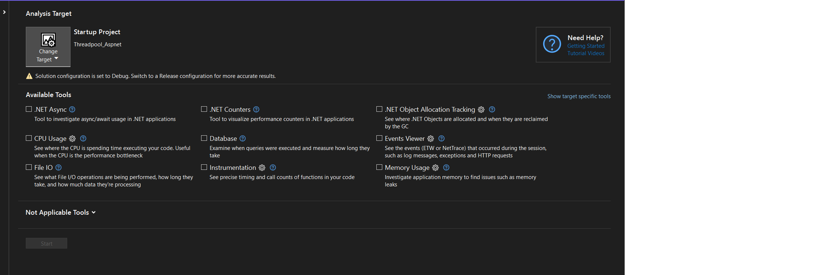

# Análise de desempenho em ciclo de desenvolvimento

Muitos problemas críticos podem ser evitados ainda no estágio de desenvolvimento da aplicação, a análise de desempenho durante o ciclo de desenvolvimento é essencial para identificar e corrigir possíveis gargalos e otimizar a eficiência do sistema em desenvolvimento.

## Uso e importância do benchmark

Você suspeita que pode fazer alguma melhoria isolada no código, optimizar um `loop` aparentemente pesado, ou até provar um conceito relacionado a desempenho e consumo de recursos? O uso de um `benchmark` vai te ajudar muito no processo, no caso do .net a ferramenta mais famosa é o [BenchmarkDotNet](https://benchmarkdotnet.org/)

O BenchmarkDotNet ajuda você a transformar métodos em benchmarks, acompanhar seu desempenho e compartilhar experimentos de medição reprodutíveis. Não é mais difícil do que escrever testes unitários! Por baixo dos panos, ele realiza muita magia que garante resultados confiáveis e precisos, graças ao motor estatístico perfolizer. O BenchmarkDotNet protege você de erros comuns em benchmarks e avisa se algo está errado com o design do seu benchmark ou com as medições obtidas. Os resultados são apresentados em uma forma fácil de entender que destaca todos os fatos importantes sobre o seu experimento. O BenchmarkDotNet já foi adotado por mais de 19100 projetos no GitHub, incluindo .NET Runtime, .NET Compiler, .NET Performance e muitos outros.

### Demo Benchmark

[demo-benchmark](../demos/demo-benchmark/)

## Ferramentas de teste de carga

As ferramentas de teste de carga são essenciais para identificar gargalos de desempenho porque permitem simular condições de uso intensivo em um sistema ou aplicação. Esses testes ajudam a avaliar o comportamento do sistema sob carga máxima, identificar pontos de estrangulamento e entender como o sistema se comporta em situações de pico de tráfego. Com essas informações, é possível otimizar o sistema, ajustar recursos e garantir um desempenho estável e eficiente em condições reais de uso.

### K6

O Grafana k6 é uma ferramenta de teste de carga de código aberto que torna os testes de desempenho fáceis e produtivos para equipes de engenharia. O k6 é gratuito, centrado no desenvolvedor e extensível.

Usando o k6, você pode testar a confiabilidade e o desempenho de seus sistemas e identificar regressões e problemas de desempenho mais cedo. O k6 ajudará você a construir aplicações resilientes e de alto desempenho que escalam.

O k6 é desenvolvido pela Grafana Labs e pela comunidade.

Os usuários do k6 geralmente são Desenvolvedores, Engenheiros de QA, SDETs e SREs. Eles utilizam o k6 para testar o desempenho e a confiabilidade de APIs, microsserviços e websites. Os casos de uso comuns do k6 incluem:

- Testes de carga: O k6 é otimizado para um consumo mínimo de recursos e projetado para executar testes de carga elevada (teste de pico, estresse, testes prolongados).

- Testes de navegador: Através do navegador k6, você pode executar testes de desempenho baseados em navegador e identificar problemas relacionados apenas aos navegadores, que podem ser ignorados no nível do protocolo.

- Testes de caos e resiliência: Você pode usar o k6 para simular tráfego como parte de seus experimentos de caos, acioná-los a partir dos seus testes k6 ou injetar diferentes tipos de falhas no Kubernetes com o xk6-disruptor.

- Monitoramento de desempenho e sintético: Com o k6, você pode automatizar e agendar testes para serem acionados com muita frequência e uma carga leve para validar continuamente o desempenho e a disponibilidade do seu ambiente de produção.

> Para instalar o K6 siga o passo a passo: [install](https://grafana.com/docs/k6/latest/get-started/installation/)

### Demo K6

[demo-k6](../demos/demo_k6/)

## Ferramentas de diagnóstico do Visual Studio

O Visual Studio oferece uma variedade de ferramentas de perfil e diagnóstico que podem ajudá-lo a diagnosticar o uso de memória e CPU e outros problemas de nível de aplicativo. Com essas ferramentas, você pode acumular dados de desempenho enquanto executa seu aplicativo. Um profiler pode ajudá-lo a tomar decisões informadas rapidamente, fornecendo uma representação visual dos tempos de execução e uso de CPU para seu aplicativo.

As ferramentas disponíveis no Performance Profiler incluem:

- CPU usage: Mede quanto tempo a CPU está ocupada executando o código do aplicativo.
- .NET object allocation: Rastreia a alocação de objetos na plataforma .NET durante a execução do aplicativo.
- Memory usage: Monitora o uso de memória pelo aplicativo, incluindo alocações e liberações de memória.
- .NET async tool: Ferramenta específica para rastrear e otimizar operações assíncronas em aplicativos .NET.
- Instrumentation: Fornece métricas detalhadas sobre o desempenho do aplicativo, como tempos de execução e chamadas de função.
- File I/O: Monitora operações de entrada e saída de arquivos realizadas pelo aplicativo.
- .NET Counters: Fornece contadores específicos do .NET para acompanhar métricas de desempenho relevantes.
- Database tool: Ferramenta para monitorar consultas e operações de banco de dados realizadas pelo aplicativo.
- GPU usage: Monitora o uso da unidade de processamento gráfico (GPU) pelo aplicativo, se aplicável.

Para ter acesso a elas basta tecla `Alt+F2` no Visual Studio.

